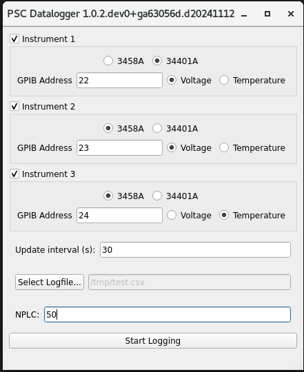

[](https://github.com/DiamondLightSource/psc-datalogger/actions/workflows/ci.yml)
[](https://codecov.io/gh/DiamondLightSource/psc-datalogger)
[](https://opensource.org/licenses/Apache-2.0)

# psc_datalogger

Provide a GUI interface to allow logging voltages from one to three Agilent 3458A Multimeters.
Logging is done at a configurable interval. It can be also be configured to convert voltage readings into
a temperature, if a Type K Thermocouple is in use.
The data is output in a CSV format.



# Installation

The simplest way to install this program is to use `pip` to install it directly from this repository:

```
python -m venv venv
source venv/bin/activate
pip install git+https://github.com/DiamondLightSource/psc-datalogger.git
```

Then the application can be started:
```
psc-datalogger
```
